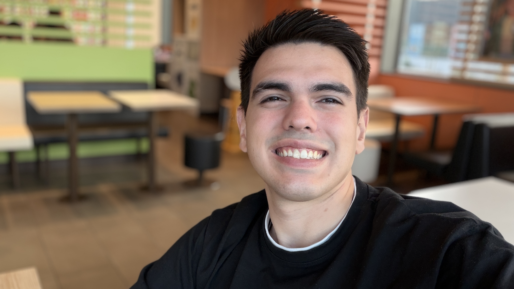

<h1 align="center">🚀 Diego Gil</h1>
<h3 align="center">💻 Desarrollador de Software en evolución | Construyendo mi futuro con código</h3>

  

🧠 Clean Code • ⚙️ Lógica & Backend • 🌍 Futuro Full Stack

  
  

---

## 🧠 Sobre mí

🎓 Estudiante de **Desarrollo de Aplicaciones Multiplataforma (DAM)**  
🔥 Enfocado en fortalecer mi base en programación y bases de datos  
📈 Mejorando constantemente mi lógica y pensamiento estructurado  

No solo escribo código.  
Entreno mi mente para pensar como ingeniero.

---

## ⚡ En qué estoy trabajando ahora

- 🧱 Java y Programación Orientada a Objetos  
- 🗄️ Diseño y consultas SQL  
- 🌐 Estructura web con HTML  

---

## 🧰 Tecnologías y herramientas

  

---

## 🎯 Visión

Convertirme en un desarrollador sólido, con bases fuertes y capacidad de crear sistemas bien estructurados.

---

⭐ Gracias por visitar mi perfil.

