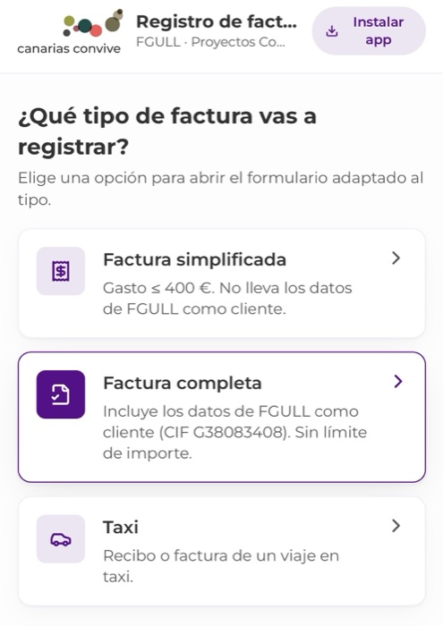

<!--
═══════════════════════════════════════════════════════════════════════════════
  README de @diegoalegil  ·  paleta tokyonight + acento rojo CTA
  ───────────────────────────────────────────────────────────────────────────
  ZONAS QUE CAMBIAN MÁS A MENUDO  (busca el emoji ✏️):
   ✏️ HERO          → título, subtítulo y botones CTA
   ✏️ BIO           → bio principal y bio extendida (
)
   ✏️ PRINCIPAL     → bloque estrella (AnimeShowdown)
   ✏️ TRABAJANDO    → proyecto activo paralelo (Canarias Convive)
   ✏️ APRENDIENDO   → 3 líneas con lo que estás trasteando ahora
   ✏️ DESTACADOS    → tabla 2x2 (rotar cuando cambien tus repos top)
   ✏️ CIERRE        → frase final
═══════════════════════════════════════════════════════════════════════════════
-->

<!-- ─── BANNER ───────────────────────────────────────────────────────────── -->

  

<!-- ─── CONTADORES VIVOS ─────────────────────────────────────────────────── -->

  
  
  

 

<!-- ─── HERO  ✏️ ─────────────────────────────────────────────────────────── -->

  <h1>Hola, soy Diego 👋</h1>
  <h3>Estudiante DAM · Backend, bases de datos y obsesiones útiles · Tenerife 🇮🇨</h3>
   
  
  

---

<!-- ─── BIO  ✏️ ──────────────────────────────────────────────────────────── -->
## 🧠 Sobre mí

> Programar es la excusa. Lo que me engancha es entender **por qué algo funciona** — o por qué se rompe a las 3 de la mañana.

  
<b>Saber más</b>

   

  Estudio **Desarrollo de Aplicaciones Multiplataforma** en Tenerife. Mi interés real está en **backend, bases de datos y arquitectura** — no solo en hacer que funcione, sino en entender por qué funciona.

  No soy el más rápido de la clase, pero suelo ser el último en irse del problema. Por eso prefiero un proyecto que entiendo a fondo antes que diez que entiendo por encima.

  Ahora mismo trasteando con **sistemas distribuidos** (CockroachDB), **PL/pgSQL avanzado** y **APIs REST** en Java y Node.js.

---

<!-- ─── MI PROYECTO PRINCIPAL  ✏️ ───────────────────────────────────────── -->
## 🌟 Mi proyecto principal

> El producto donde mejor se ve cómo trabajo: full-stack de cero, decisiones técnicas defendibles y desplegado en producción real.

<!-- ── ⚔️ AnimeShowdown — proyecto estrella ────────────────────────────── -->
<table align="center">
  <tr>
    <td width="32%" valign="top" align="center">
      
    </td>
    <td width="68%" valign="top">
      <h3>⚔️ AnimeShowdown</h3>
      

        <b>Plataforma full-stack de duelos, torneos y ranking ELO de personajes anime.</b> Frontend, API, BBDD, auth y despliegue en producción real — construido de cero.
      

      

        
        
        
        
      

      <ul>
        <li><b>Ranking ELO</b> que reordena en tiempo real con cada votación y cierre de torneo.</li>
        <li><b>Brackets visuales</b> SVG y resolución transaccional de enfrentamientos por conteo de votos.</li>
        <li><b>Auth completa</b>: JWT con refresh por cookie httpOnly, 2FA TOTP y emails transaccionales.</li>
        <li><b>API REST</b> documentada con OpenAPI 3 + Swagger UI · desplegada en <b>Cloudflare Pages + Railway + Neon</b>.</li>
      </ul>
      

        
        
        
        
        
        
        
        
        
        
      

    </td>
  </tr>
</table>

---

<!-- ─── ESTOY TRABAJANDO EN  ✏️ ─────────────────────────────────────────── -->
## 🚧 Estoy trabajando en

<!-- ── 📄 Canarias Convive — práctica profesional en la ULL ────────────── -->
<table align="center">
  <tr>
    <td width="30%" valign="middle" align="center">
      
    </td>
    <td width="70%" valign="middle">
      <h3>📄 Sistema de facturas — Canarias Convive</h3>
      

        <b>Prácticas en la Fundación General de la ULL.</b> Estoy automatizando el flujo de gastos del proyecto <b>Canarias Convive</b>: tickets en papel, fotos y PDFs sueltos pasan a un sistema centralizado con <b>trazabilidad, validaciones automáticas y envío directo</b> al departamento de pagos.
      

      

        <b>Backend</b> en Google Apps Script sobre Sheet + Drive, con <b>7 validaciones</b> automáticas (importes, fechas, CIF/NIF, duplicados) y status por color. <b>Frontend público</b> en Next.js + Vercel para registrar facturas desde el móvil, instalable como app en iPhone y Mac.
      

      

        
        
        
        
        
        
      

      

        🏛️ Proyecto interno · en validación final antes de pasar a producción
      

    </td>
  </tr>
</table>

---

## 🛠️ Stack

<table align="center">
  <tr>
    <td valign="top" width="50%">
      <h3 align="center">⚙️ Backend</h3>
      

        
        
        
      

    </td>
    <td valign="top" width="50%">
      <h3 align="center">🗄️ Bases de datos</h3>
      

        
        
        
      

    </td>
  </tr>
  <tr>
    <td valign="top" width="50%">
      <h3 align="center">🌐 Web</h3>
      

        
        
        
        
      

    </td>
    <td valign="top" width="50%">
      <h3 align="center">🧰 Tooling</h3>
      

        
        
        
      

    </td>
  </tr>
</table>

  

---

<!-- ─── APRENDIENDO  ✏️ ──────────────────────────────────────────────────── -->
## 🌱 Aprendiendo ahora

<table align="center">
  <tr>
    <td>🐘 <b>PL/pgSQL avanzado</b> triggers, procedimientos, ACID</td>
    <td>🌍 <b>Sistemas distribuidos</b> réplicas y consenso con CockroachDB</td>
    <td>🔌 <b>APIs REST</b> arquitectura y diseño en Java / Node.js</td>
  </tr>
</table>

---

<!-- ─── DESTACADOS  ✏️ ──────────────────────────────────────────────────── -->
## 💾 Proyectos destacados

<table>
  <tr>
    <td width="50%" valign="top">
      <h3 align="center">💳 TinerPay</h3>
      

        Demo de un <b>sistema de pagos distribuido</b>. Replicación, consistencia y transacciones en una base de datos pensada para no caerse.
      

      

        
        
        
      

      

        <a href="https://github.com/diegoalegil/TinerPay"><b>Ver código →</b></a>
      

    </td>
    <td width="50%" valign="top">
      <h3 align="center">🐘 postgresql-avanzado</h3>
      

        PL/pgSQL real: <b>triggers, procedimientos almacenados, transacciones ACID</b> y estrategias de backup. Centrado en integridad y concurrencia.
      

      

        
        
      

      

        <a href="https://github.com/diegoalegil/postgresql-avanzado"><b>Ver código →</b></a>
      

    </td>
  </tr>
  <tr>
    <td width="50%" valign="top">
      <h3 align="center">🏋️ gimnasio-app</h3>
      

        Aplicación de <b>gestión de gimnasio</b> en Java. POO aplicada a un dominio real: socios, rutinas, pagos.
      

      

        
        
      

      

        <a href="https://github.com/diegoalegil/gimnasio-app"><b>Ver código →</b></a>
      

    </td>
    <td width="50%" valign="top">
      <h3 align="center">🏎️ miniature-car-shop</h3>
      

        Tienda <b>WooCommerce premium</b> de miniaturas con diseño oscuro, animaciones y módulos JS/PHP propios sobre WordPress.
      

      

        
        
        
      

      

        <a href="https://github.com/diegoalegil/miniature-car-shop"><b>Ver código →</b></a>
      

    </td>
  </tr>
</table>

---

## 📊 Stats

  
  

  
  

<!-- ─── SNAKE ANIMATION ──────────────────────────────────────────────────────
  Para que aparezca, necesitas el workflow .github/workflows/snake.yml (ya incluido).
  Tras hacer push a main, ejecuta el workflow manualmente desde la pestaña Actions
  la primera vez. Después se regenera automáticamente cada 24h.
─────────────────────────────────────────────────────────────────────────── -->

  

---

## 🏆 Trofeos

  

---

<!-- ─── MANTENIMIENTO (notas internas, no se renderizan) ──────────────────
  - Zonas editables marcadas con ✏️ en los comentarios HTML.
  - La animación de la serpiente la genera .github/workflows/snake.yml cada
    noche y se publica en la rama output. Si nunca se ha ejecutado, lánzalo
    manualmente desde Actions → Generate Snake animation → Run workflow.
  - Las imágenes viven en images/. Mantén cualquier nueva por debajo de
    ~500 KB (banner máx 1600 px de ancho, ilustraciones pequeñas a 800 px).
  - Acciones de terceros del workflow pineadas por SHA por seguridad de
    supply chain — si actualizas una versión, actualiza también el SHA.
─────────────────────────────────────────────────────────────────────────── -->

<!-- ─── CIERRE  ✏️ ───────────────────────────────────────────────────────── -->

   
  <i>"No me considero un programador con talento. Soy un dedicado que casualmente programa."</i>
    
  <a href="mailto:diegogildam@gmail.com">📨 diegogildam@gmail.com</a>
  &nbsp;·&nbsp;
  <a href="https://diegoalegil.github.io/">🌐 diegoalegil.github.io</a>

