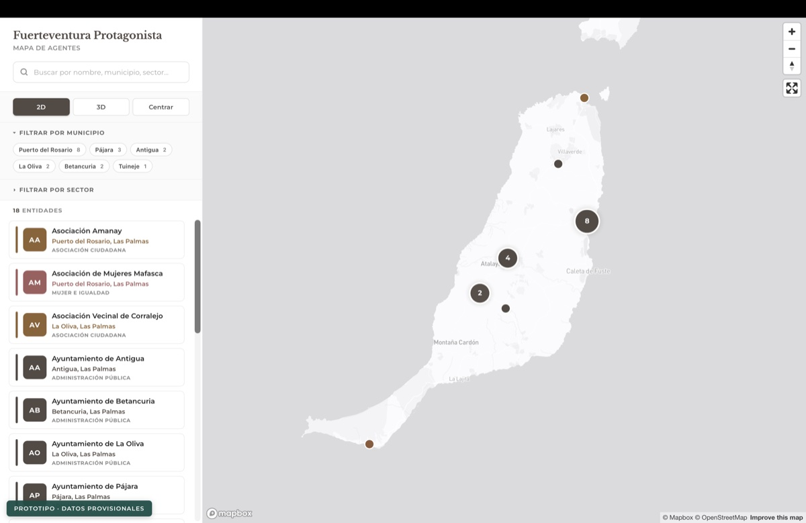

<!--
═══════════════════════════════════════════════════════════════════════════════
  README de @diegoalegil  ·  paleta tokyonight + acento rojo CTA
  ───────────────────────────────────────────────────────────────────────────
  ZONAS QUE CAMBIAN MÁS A MENUDO  (busca el emoji ✏️):
   ✏️ HERO          → título, subtítulo y botones CTA
   ✏️ PRODUCCIÓN    → bloque destacado (Canarias Convive · en producción real)
   ✏️ PRINCIPAL     → bloque estrella (AnimeShowdown)
   ✏️ TRABAJANDO    → sección oculta (Fuerteventura, reactivar al salir a prod)
   ✏️ APRENDIENDO   → 3 líneas con lo que estás trasteando ahora
   ✏️ DESTACADOS    → tabla 2x2 (rotar cuando cambien tus repos top)
   ✏️ CIERRE        → frase final
═══════════════════════════════════════════════════════════════════════════════
-->

<!-- ─── BANNER ───────────────────────────────────────────────────────────── -->

  

<!-- ─── CONTADORES VIVOS ─────────────────────────────────────────────────── -->

  
  
  

 

<!-- ─── HERO  ✏️ ─────────────────────────────────────────────────────────── -->

  <h1>Hola, soy Diego 👋🏻</h1>
  
<b>Estudiante DAM · Backend, bases de datos y obsesiones útiles · Tenerife 🇮🇨</b>

   
  
  

---

<!-- ─── 🚀 EN PRODUCCIÓN  ✏️ ──────────────────────────────────────────────── -->
## 🚀 En producción

> Código mío sirviendo en una web institucional real, ahora mismo.

<table align="center">
  <tr>
    <td width="48%" valign="middle" align="center">
      
    </td>
    <td width="52%" valign="middle">
      

        
        
      

      <h3>🗺️ Mapa de agentes — Canarias Convive</h3>
      

        El mapa público que sirve <a href="https://canariasconvive.com/mapa-interactivo/"><b>canariasconvive.com</b></a> en producción. Una plataforma del <b>Gobierno de Canarias + ULL</b> depende de este repositorio para mostrar al público las <b>234 entidades</b> del programa por todo el archipiélago.
      

      

        <b>Mapbox GL JS</b> con estilo <b>custom de Mapbox Studio</b> (paleta corporativa), <b>clustering</b> automático, <b>filtros por sector</b> y <b>vista 3D</b>. Datos servidos desde la API REST oficial. HTML/CSS/JS vanilla, sin frameworks.
      

      

        
        
        
        
        
      

      

        <a href="https://canariasconvive.com/mapa-interactivo/"><b>🟢 Ver en producción</b></a>
        &nbsp;·&nbsp;
        <a href="https://diegoalegil.github.io/canariasconvive-mapa/"><b>Demo</b></a>
        &nbsp;·&nbsp;
        <a href="https://github.com/diegoalegil/canariasconvive-mapa"><b>Repo →</b></a>
      

    </td>
  </tr>
</table>

---

<!-- ─── MI PROYECTO PRINCIPAL  ✏️ ───────────────────────────────────────── -->
## 🌟 Mi proyecto principal

> El producto donde mejor se ve cómo trabajo: full-stack de cero, decisiones técnicas defendibles y desplegado en producción real.

<!-- ── ⚔️ AnimeShowdown — proyecto estrella ────────────────────────────── -->
<table align="center">
  <tr>
    <td width="32%" valign="top" align="center">
      
    </td>
    <td width="68%" valign="top">
      <h3>⚔️ AnimeShowdown</h3>
      

        <b>Plataforma full-stack de duelos, torneos y ranking ELO de personajes anime.</b> Frontend, API, BBDD, auth y despliegue en producción real — construido de cero.
      

      

        
        
        
        
      

      <ul>
        <li><b>Ranking ELO</b> que reordena en tiempo real con cada votación y cierre de torneo.</li>
        <li><b>Brackets visuales</b> SVG y resolución transaccional de enfrentamientos por conteo de votos.</li>
        <li><b>Auth completa</b>: JWT con refresh por cookie httpOnly, 2FA TOTP y emails transaccionales.</li>
        <li><b>API REST</b> documentada con OpenAPI 3 + Swagger UI · desplegada en <b>Cloudflare Pages + Railway + Neon</b>.</li>
      </ul>
      

        
        
        
        
        
        
        
        
        
        
      

    </td>
  </tr>
</table>

---

<!-- ─── 🚧 ESTOY TRABAJANDO EN — sección oculta hasta que Fuerteventura entre en producción ──
     Canarias Convive se promovió a la sección "🚀 En producción" (arriba del todo).
     La tarjeta de Fuerteventura Protagonista (todavía prototipo, con datos placeholder)
     queda guardada aquí para reactivar la sección cuando el proyecto esté listo.
     PARA REACTIVAR: retira este wrapper de comentario y restaura el encabezado
     "## 🚧 Estoy trabajando en".

  <table align="center">
    <tr>
      <td width="50%" valign="middle" align="center">
        
      </td>
      <td width="50%" valign="middle">
        <h3>🏝️ Mapa de agentes — Fuerteventura Protagonista</h3>
        

          <b>Mismo enfoque, otra isla.</b> Prototipo del mapa público de <b>Fuerteventura Protagonista</b> (Cabildo de Fuerteventura + ULL). Misma base técnica que el de Canarias Convive pero con <b>paleta marrón/tierra</b> y tipografía <b>Libre Baskerville</b> para casar con la identidad del programa.
        

        

          <b>HTML, CSS y JavaScript vanilla</b> sobre <b>Mapbox GL JS 3.21</b> + <b>Turf.js</b> para las geometrías 3D. <b>18 puntos placeholder</b> (ayuntamientos, Cabildo, entidades públicas) a la espera de importar el back-office real.
        

        

          Mapbox GL JS · Turf.js · JavaScript · HTML5 · CSS3 · GitHub Pages
        

        

          Demo: diegoalegil.github.io/fuerteventuraprotagonista-mapa
          · Repo: github.com/diegoalegil/fuerteventuraprotagonista-mapa
        

      </td>
    </tr>
  </table>
─────────────────────────────────────────────────────────────────────────────────────── -->

---

## 🛠️ Stack

<table align="center">
  <tr>
    <td valign="top" width="50%">
      <h3 align="center">⚙️ Backend</h3>
      

        
        
        
      

    </td>
    <td valign="top" width="50%">
      <h3 align="center">🗄️ Bases de datos</h3>
      

        
        
        
      

    </td>
  </tr>
  <tr>
    <td valign="top" width="50%">
      <h3 align="center">🌐 Web</h3>
      

        
        
        
        
      

    </td>
    <td valign="top" width="50%">
      <h3 align="center">🧰 Tooling</h3>
      

        
        
        
      

    </td>
  </tr>
</table>

  

---

<!-- ─── APRENDIENDO  ✏️ ──────────────────────────────────────────────────── -->
## 🌱 Aprendiendo ahora

<table align="center">
  <tr>
    <td>🐘 <b>PL/pgSQL avanzado</b> triggers, procedimientos, ACID</td>
    <td>🌍 <b>Sistemas distribuidos</b> réplicas y consenso con CockroachDB</td>
    <td>🔌 <b>APIs REST</b> arquitectura y diseño en Java / Node.js</td>
  </tr>
</table>

---

<!-- ─── DESTACADOS  ✏️ ──────────────────────────────────────────────────── -->
## 💾 Proyectos destacados

<table>
  <tr>
    <td width="50%" valign="top">
      <h3 align="center">💳 TinerPay</h3>
      

        Demo de un <b>sistema de pagos distribuido</b>. Replicación, consistencia y transacciones en una base de datos pensada para no caerse.
      

      

        
        
        
      

      

        <a href="https://github.com/diegoalegil/TinerPay"><b>Ver código →</b></a>
      

    </td>
    <td width="50%" valign="top">
      <h3 align="center">🐘 postgresql-avanzado</h3>
      

        PL/pgSQL real: <b>triggers, procedimientos almacenados, transacciones ACID</b> y estrategias de backup. Centrado en integridad y concurrencia.
      

      

        
        
      

      

        <a href="https://github.com/diegoalegil/postgresql-avanzado"><b>Ver código →</b></a>
      

    </td>
  </tr>
  <tr>
    <td width="50%" valign="top">
      <h3 align="center">🏋️ gimnasio-app</h3>
      

        Aplicación de <b>gestión de gimnasio</b> en Java. POO aplicada a un dominio real: socios, rutinas, pagos.
      

      

        
        
      

      

        <a href="https://github.com/diegoalegil/gimnasio-app"><b>Ver código →</b></a>
      

    </td>
    <td width="50%" valign="top">
      <h3 align="center">🏎️ miniature-car-shop</h3>
      

        Tienda <b>WooCommerce premium</b> de miniaturas con diseño oscuro, animaciones y módulos JS/PHP propios sobre WordPress.
      

      

        
        
        
      

      

        <a href="https://github.com/diegoalegil/miniature-car-shop"><b>Ver código →</b></a>
      

    </td>
  </tr>
</table>

---

## 📊 Stats

  
  

  
  

<!-- ─── SNAKE ANIMATION ──────────────────────────────────────────────────────
  La snake la genera el workflow .github/workflows/activity-graph.yml ("Update
  profile assets"), que publica todos los assets en la rama output. La primera
  vez, lánzalo desde Actions → Update profile assets → Run workflow.
─────────────────────────────────────────────────────────────────────────── -->

  

---

<!-- ─── ACTIVIDAD ─────────────────────────────────────────────────────────
     Gráfico de área con la evolución de contribuciones del último año.
     Base: Ashutosh00710/github-readme-activity-graph (Vercel) — el SVG se
     genera ahí y se post-procesa con scripts/inject-activity-animation.py
     para inyectar animaciones SMIL Apple-style: stroke-draw de la línea
     con easing ease-in-out, fade-in del área tras dibujarse, y aparición
     escalonada de los puntos con un toque de spring. El SVG resultante
     se publica en la rama output (junto con la snake y las tarjetas de
     stats) para que las animaciones sobrevivan al paso por el CDN de GitHub.
─────────────────────────────────────────────────────────────────────── -->
## 📈 Actividad

  

<!-- ─── MANTENIMIENTO (notas internas, no se renderizan) ──────────────────
  - Zonas editables marcadas con ✏️ en los comentarios HTML.
  - Snake, gráfico de actividad y tarjetas de stats los genera y publica en la
    rama output el workflow .github/workflows/activity-graph.yml ("Update
    profile assets") cada noche. Primera vez: Actions → Run workflow.
  - Las imágenes viven en images/. Mantén cualquier nueva por debajo de
    ~500 KB (banner máx 1600 px de ancho, ilustraciones pequeñas a 800 px).
  - Acciones de terceros del workflow pineadas por SHA por seguridad de
    supply chain — si actualizas una versión, actualiza también el SHA.
─────────────────────────────────────────────────────────────────────────── -->

<!-- ─── CIERRE  ✏️ ───────────────────────────────────────────────────────── -->

   
   
  <table align="center" border="0">
    <tr>
      <td width="32%" valign="middle" align="center">
        
      </td>
      <td width="68%" valign="middle">
        

          <i>"Todo lo que te rodea que llamas vida fue hecho por gente que <b>no era más inteligente que tú</b> y lo puedes cambiar, puedes influenciar, puedes <b>construir tus propias cosas que otra gente pueda usar</b>."</i>
        

         
        

          <i>"Todos tenemos la capacidad de hacer grandes cosas. 
          <b>No debemos poner límites a nuestra imaginación.</b>"</i>
        

         
        

          —&nbsp;&nbsp;<kbd>&nbsp;<b>STEVE&nbsp;JOBS</b>&nbsp;</kbd>&nbsp;&nbsp;
        

      </td>
    </tr>
  </table>
   
   
  <a href="mailto:diegogildam@gmail.com">📨 diegogildam@gmail.com</a>
  &nbsp;·&nbsp;
  <a href="https://diegoalegil.github.io/">🌐 diegoalegil.github.io</a>

